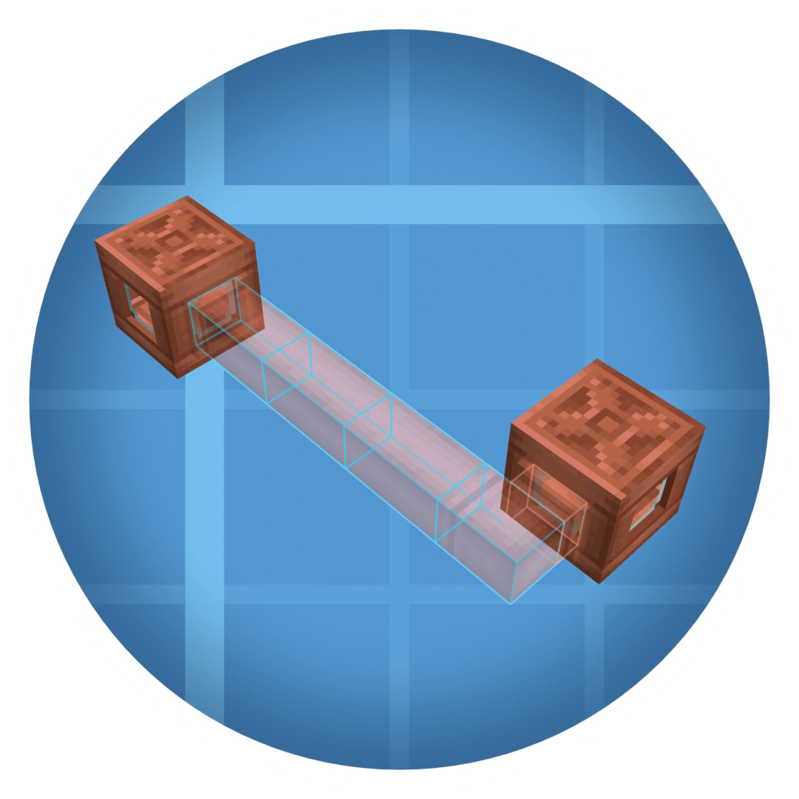



# Create: Pipe Connector

⚡ **Tired of laying pipes block by block? Connect them instantly.**

A utility addon for [Create](https://github.com/Creators-of-Create/Create) on Minecraft `1.21.1`.

---

## 🚀 The Purpose: Why this addon?

Designing massive factories in **Create** is incredibly rewarding, but routing long, winding fluid pipelines block by block can quickly become a tedious chore.

**Create: Pipe Connector** is here to fix that. It eliminates the monotony of manual routing by letting you select two points and instantly filling the shortest valid path between them. Spend less time wrestling with pipe placement and more time optimizing your factory lines!

---

## 🕹️ PLAYER SECTION (Usage & Features)

### ✨ Key Features

- **Instant Auto-Connection:** Link two distant pipes with a simple click combination.
- **Smart Pathfinding:** The mod automatically calculates the shortest valid route around obstacles.
- **Zero-Waste Ghost Preview:** See exactly where the pipes will go before spending a single item.
- **Anchor Waypoints:** Add or remove intermediate anchors to guide long or complex routes.
- **Survival Inventory Check:** Shows required/available pipes and blocks placement when you do not have enough.
- **Configurable Controls:** Rebind the preview lock and anchor controls from Minecraft's Controls menu.
- **Seamless Integration:** Fully refreshes Create's pipe networks instantly upon placement to avoid broken fluid flows.

### 📦 Supported Blocks

- `create:fluid_pipe`
- `create:smart_fluid_pipe`

### 🔧 How to Use It

1.  **Select Start:** Hold a Create pipe in the off-hand, keep the main hand empty, then sneak and right-click.
2.  **Guide the Route:** Move your crosshair to preview the route. Press `C` to add an anchor and `V` to remove the last anchor.
3.  **Lock Preview:** Press `Left Alt` to freeze/unfreeze the current preview target while you move around.
4.  **Confirm:** Sneak and right-click again to place the full planned line.
5.  **Customize Controls:** Open Minecraft's `Options > Controls > Key Binds` and look for `Create: Pipe Connector`.

### 📋 Requirements

- **Minecraft:** `1.21.1`
- **NeoForge:** `21.1.219` or compatible
- **Create:** `6.0.10-280` or compatible
- **Java:** `21`

---

## 📦 MODPACKMAKER SECTION

- `Create` is required at runtime.
- No extra hard dependencies are declared beyond `Minecraft`, `NeoForge`, and `Create`.
- This branch targets the official NeoForge Create `1.21.1` release line.
- _Note: This addon is currently in **Beta (0.2.0-beta)**, meaning features are evolving rapidly._

💬 **We need your feedback!**  
Are you a player with a cool feature idea, or a modpack maker who found a bug? We want to hear from you! Please **open an Issue** or drop a comment with your suggestions, tweaks, or feature requests to help us shape the definitive version of this tool.

---

## 💻 DEVELOPER SECTION (Modders & Devs)

> 💡 **Repository Note:** This branch is NeoForge-only. Shared placement logic lives in `common`, while the active runtime implementation lives in `neoforge`.

### 🛠️ Project Structure & Flow

If you want to contribute, extend block support, or review the codebase, here is where the core logic lives:

- **Core Logic (`/common`):**  
  Shared backend logic lives in `common/src/main/java/com/javiluli/createpipeconnector/connector/PipeConnectorLogic.java`.  
  _If you want to extend block support, add it here first to keep loader-specific code thin._
- **NeoForge Implementation (`/neoforge`):**  
  Owns the entrypoint, event registration, networking, key binds, server-side placement bridge, and client preview renderer.
- **Rendering (`/neoforge/.../client/render`):**
  The ghost preview system is managed by `PipeGhostRenderer.java`, with anchor highlights in the `overlay` package.

### 🚀 Building the Project

- Run the NeoForge dev client: `./gradlew :neoforge:runClient`
- Build the NeoForge artifact: `./gradlew :neoforge:build`

### 📖 Technical Documentation

For deeper insights, check out our internal markdown guides:

- `docs/PLAYER_GUIDE.md` - In-depth player usage
- `docs/MODPACK_GUIDE.md` - Packmaker notes & advanced integration
- `docs/DEV_GUIDE.md` - Implementation details & architecture flow
- `docs/API.md` - Cross-mod integration capabilities
