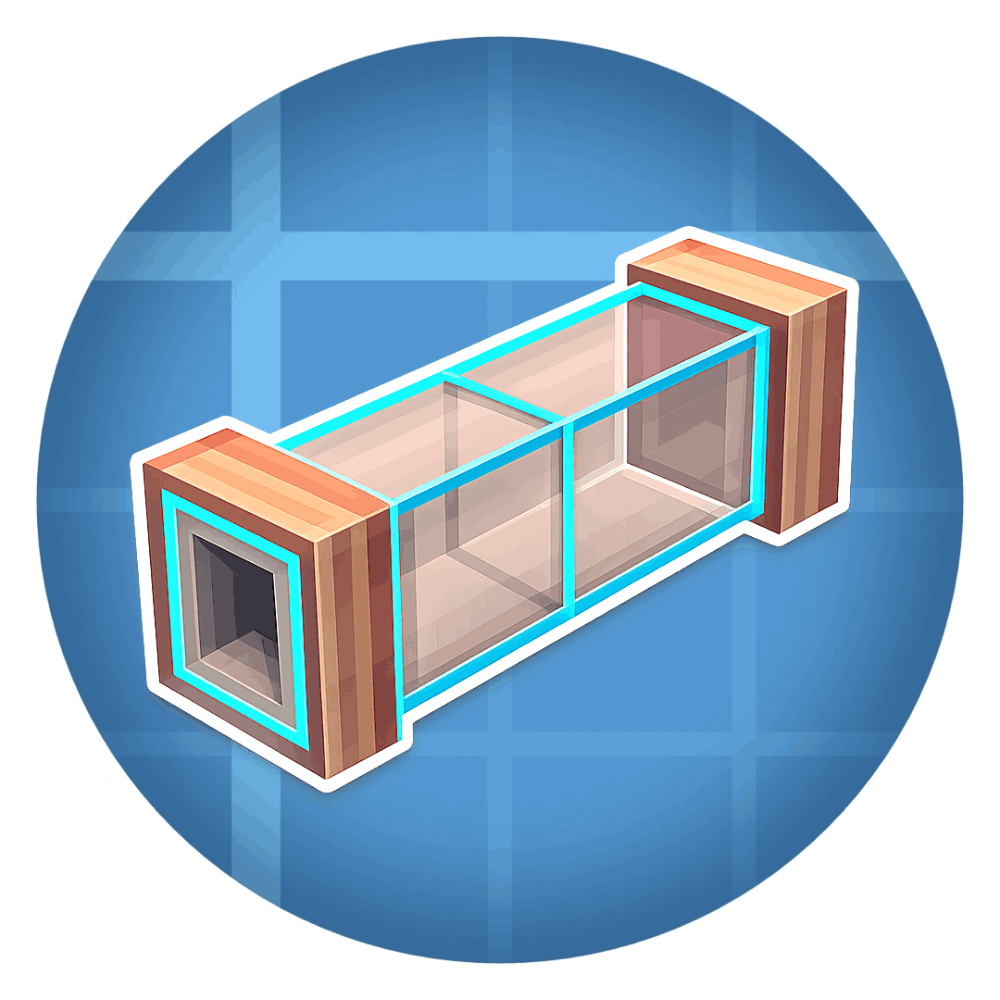

<div align="center">
<a></a>

# Create: Pipe Connector

**Build Create fluid pipe routes faster: preview the path, adjust it, and place it in one action.**

A utility addon for [Create](https://github.com/Creators-of-Create/Create). Available builds are listed below.


<a href="https://www.curseforge.com/minecraft/mc-mods/create-pipe-connector">

</a>
<a href="https://modrinth.com/mod/create-pipe-connector">

</a>


</div>

---

## What Is It?

**Create: Pipe Connector** adds a dedicated pipe-connection mode for Create fluid pipes.

Instead of placing long pipe lines block by block, you select a start point, aim where the route should go, preview the result, and confirm once. The addon can also add pumps, casing, and glass pipe styling while showing material requirements before placement.

## Main Features

- **Ghost preview:** See the route before spending items.
- **Progressive construction:** Confirmed routes appear at a configurable speed instead of all at once.
- **Animation settings:** Choose from `1-20` pieces per second or disable the animation for instant placement.
- **Smart routing:** Finds a valid path around obstacles.
- **Anchors:** Add waypoints to force turns or guide the route.
- **Radial menu:** Change route style, pumps, flow direction, casing, and pipe style.
- **Survival checks:** Shows required/available materials and blocks placement if items are missing.
- **Create wrench shortcut:** Toggle straight pipe segments between default and glass style.

## Supported Create Blocks

The connector places and routes:

- `create:fluid_pipe`

Optional features use:

- `create:mechanical_pump`
- `create:glass_fluid_pipe`
- `create:copper_casing`
- `create:encased_fluid_pipe`

`create:smart_fluid_pipe` is intentionally not used as a route pipe because it is a filtering pipe, not a normal connector pipe.

## Default Controls

Only the most important controls are bound by default:

| Action                                       | Default     |
| -------------------------------------------- | ----------- |
| Toggle Connector Pipe mode                   | `B`         |
| Start / confirm route                        | Right-click |
| Open radial menu                             | `N`         |
| Add anchor                                   | `C`         |
| Lock preview target / freecam-style planning | `Left Alt`  |
| Cancel current route                         | Left-click  |

Extra shortcuts for pump mode, pump direction, casing, glass style, manual pumps, and undo actions are available in Minecraft's Controls menu but are **unassigned by default**. You can use the radial menu instead, or bind them yourself.

## Quick Start

1. Press `B` to enable **Connector Pipe** mode.
2. Hold a `create:fluid_pipe` in either hand.
3. Right-click a reachable block or pipe face to start.
4. Move your crosshair to preview the route.
5. Optional: press `C` to add anchors.
6. Optional: press `Left Alt` to lock the preview target while moving.
7. Optional: press `N` to open the radial menu.
8. Right-click again to place the route.
9. Left-click during preview to cancel only the current route.

### Placement Animation

Open `Mods -> Create: Pipe Connector -> Config` to change how confirmed routes are built.

- Keep **Animate route construction** enabled for the animated building effect.
- Choose from `1` to `20` pieces per second (`20` by default).
- The remaining speed and preview controls become unavailable when route animation is disabled.
- Independently show or hide the complete outline-free route and the highlighted next piece.
- Pieces always appear individually; the mod never places animation batches in the same tick.
- Disable it to place the complete route instantly.
- Changes are saved and synchronized as soon as you adjust them.
- In multiplayer, each route uses the preference of the player who confirmed it.
10. Press `B` again to leave Connector Pipe mode.

## Radial Menu Options

- **Route:** Auto, horizontal first, vertical first, X first, Z first, or avoid vertical.
- **Pumps:** Off, efficient spacing, or safer shorter spacing.
- **Flow:** Normal or reversed automatic pump direction.
- **Casing:** No casing, manual casing marks, or full-route casing.
- **Style:** Default pipes or glass straight sections.

Tip: `Avoid vertical` is useful for natural terrain, but very long or complex routes can be heavier than the other route modes.

## Survival Materials

The HUD shows material counts as:

```txt
required/available
```

If a route needs more items than you have, missing preview pieces are tinted red and placement is blocked.

Copper casing works like Create: you only need at least one `create:copper_casing` in your inventory to apply casing. It is not consumed per pipe.

## Requirements

- **Minecraft:** `1.20.1`
- **Forge:** `47.4.20` or compatible `47.x`
- **Create:** `6.0.6` or compatible `6.0.x`
- **Java:** `17`

## Modpack Notes

- Install on both client and server.
- Requires Create at runtime.
- No extra runtime dependencies beyond Minecraft, Forge, and Create.
- Current Forge version: **`1.1.0`**.
- Report route or preview edge cases with screenshots and the relevant client or server log.

## Developer Notes

This branch targets Forge for Minecraft `1.20.1` as a single Gradle module. The code uses a Create-inspired, feature-first structure under `src/main/java`: gameplay mechanics stay together, shared foundations remain small, and Forge registration is isolated from feature logic.

- Shared immutable plan: `src/main/java/com/javiluli/createpipeconnector/core/model/ConnectionPlan.java`
- Connector facade, planning, selection, and sessions: `src/main/java/com/javiluli/createpipeconnector/feature/connector`
- Player session state: `src/main/java/com/javiluli/createpipeconnector/feature/connector/session`
- Routing and preview building: `src/main/java/com/javiluli/createpipeconnector/feature/routing` and `src/main/java/com/javiluli/createpipeconnector/feature/preview`
- Ghost preview renderer: `src/main/java/com/javiluli/createpipeconnector/feature/preview/client/PipeGhostRenderer.java`
- Radial menu and HUD: `src/main/java/com/javiluli/createpipeconnector/feature/ui/client`
- Payload registration: `src/main/java/com/javiluli/createpipeconnector/bootstrap/ForgePayloadRegistry.java`
- Feature-independent Forge infrastructure: `src/main/java/com/javiluli/createpipeconnector/platform`

Build commands:

- Run client: `./gradlew runClient`
- Build jar: `./gradlew build`
- Build release copy: `./gradlew buildRelease`

More docs:

- `docs/PLAYER_GUIDE.md`
- `docs/MODPACK_GUIDE.md`
- `docs/DEV_GUIDE.md`
- `docs/API.md`
